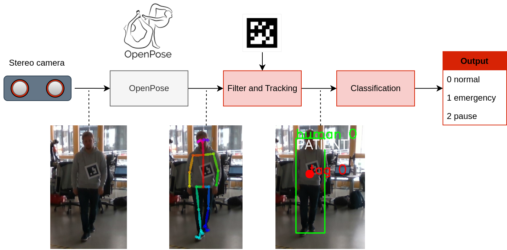
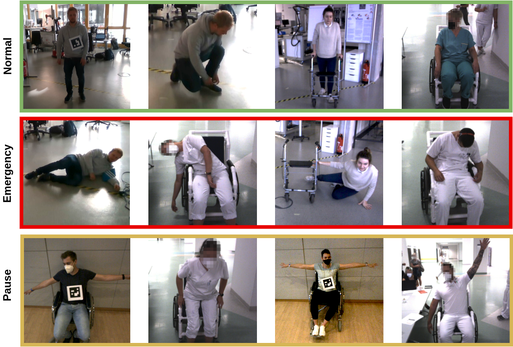

<div style="text-align: center;">
<a href="https://www.linkedin.com/in/andreas-zachariae/"></a>
<a href="https://github.com/AndreasZachariae"></a>
<a href="https://www.h-ka.de/iras/profil"></a>
</div>

## Projects

[Project 1](./project_1.html).

## Publications

1. **"Human Emergency Detection during Autonomous Hospital Transports" ([Arxiv](https://arxiv.org/abs/2307.08359))**
    
   - Authors: Andreas Zachariae, Julia Widera, Frederik Plahl, Björn Hein, Christian Wurll
   - 2023, Proceedings of the 18th International Conference IAS-18
   - Best paper candidate of IAS-18, 2023 in Suwon, Korea
        <details>
        <summary>⯈Abstract</summary>

        Human transports in hospitals are labor-intensive and primarily performed in beds to save time. This transfer method does not promote the mobility or autonomy of the patient. To relieve the caregivers from this time-consuming task, a mobile robot is developed to autonomously transport humans around the hospital. It provides different transfer modes including walking and sitting in a wheelchair. The problem that this paper focuses on is to detect emergencies and ensure the well-being of the patient during the transport. For this purpose, the patient is tracked and monitored with a camera system. OpenPose is used for Human Pose Estimation and a trained classifier for emergency detection. We collected and published a dataset of 18,000 images in lab and hospital environments. It differs from related work because we have a moving robot with different transfer modes in a highly dynamic environment with multiple people in the scene using only RGB-D data. To improve the critical recall metric, we apply threshold moving and a time delay. We compare different models with an AutoML approach. This paper shows that emergencies while walking are best detected by a SVM with a recall of 95.8% on single frames. In the case of sitting transport, the best model achieves a recall of 62.2%. The contribution is to establish a baseline on this new dataset and to provide a proof of concept for the human emergency detection in this use case.
        </details>
        <details>
        <summary>⯈Citation</summary>  

        ```
        @misc{zachariae2023human,
            title={Human Emergency Detection during Autonomous Hospital Transports}, 
            author={Andreas Zachariae and Julia Widera and Frederik Plahl and Björn Hein and Christian Wurll},
            year={2023},
            eprint={2307.08359},
            archivePrefix={arXiv},
            primaryClass={cs.RO}
        }
        ``` 

        </details>


2. **Dataset for Human Emergency Detection**
    
    - 18,000 single images from 200 videos as a single label, multiclass classification problem.
    - Use case of a moving mobile robot in a highly dynamic environment with multiple people.
    - [Link to dataset (GitHub)](https://github.com/AndreasZachariae/PeTRA_Dataset_Human_Emergency_Detection)

3. **(German) "PeTRA – Autonomer Personentransport in Krankenhäusern" ([Link](https://www.h-ka.de/fileadmin/Hochschule_Karlsruhe_HKA/Bilder_VW-PK/Publikationen/Forschungsbericht/HKA_ZH_Forschung_aktuell_2022.pdf))**
   - Authors: Andreas Zachariae, Frederik Plahl, Björn Hein, Christian Wurll
   - 2022, Forschung aktuell
        <details>
        <summary>⯈Abstract</summary>

        Das Pflegepersonal in Krankenhäusern ist durch zeitaufwändige Transportaufgaben stark gefordert. Um im Kontext des Pflegenotstands weiterhin „gute Pflege“ leisten zu können, ist eine Entlastung notwendig. Das durch das BMBF geförderte Projekt „PeTRA“ hat das Ziel, den Personentransport in Krankenhäusern zu automatisieren. Dieser Beitrag zeigt die Forschungsansätze der Hochschule Karlsruhe im Bereich des autonomen Personentransports. Neben einer modularen Softwarearchitektur und intuitiven Benutzerschnittstellen wurde an einer Überwachung des Gesundheitszustands beim Personentransport geforscht. Zusätzlich integriert die Hochschule Karlsruhe alle Ergebnisse der Projektpartner in einem Demonstrator.
        </details>
        <details>
        <summary>⯈Citation</summary>  

        ```bibtex
        @article{zachariae_petra_2022-1,
            title = {PeTRA – {Autonomer} {Personentransport} in {Krankenhäusern}},
            volume = {2022},
            copyright = {All rights reserved},
            issn = {1613-4958},
            url = {https://www.h-ka.de/fileadmin/Hochschule_Karlsruhe_HKA/Bilder_VW-PK/Publikationen/Forschungsbericht/HKA_ZH_Forschung_aktuell_2022.pdf},
            urldate = {2022-11-17},
            journal = {Forschung aktuell},
            author = {Zachariae, Andreas and Plahl, Frederik and Wurll, Christian and Hein, Björn},
            month = {jun},
            year = {2022},
            pages = {92--95}
        } 
        ```

        </details>

4. **(German) "Softwareentwicklung des Personen-Transfer Roboter-Assistenten (PeTRA) zur Unterstützung von Pflegekräften"**
   - Authors: Andreas Zachariae, Christian Wurll, Moritz Weisenböhler, Javier Moviglia
   - 2022, Poster Presentation, 4. Clusterkonferenz „Zukunft der Pflege“
        <details>
        <summary>⯈Citation</summary>  

        ```bibtex
        @inproceedings{zachariae_softwareentwicklung_2022,
            address = {Hannover},
            title = {Softwareentwicklung des {Personen}-{Transfer} {Roboter}-{Assistenten} ({PeTRA}) zur {Unterstützung} von {Pflegekräften}},
            copyright = {All rights reserved},
            booktitle = {4. {Clusterkonferenz} „{Zukunft} der {Pflege}“},
            author = {Zachariae, Andreas and Wurll, Christian and Weisenböhler, Moritz and Moviglia, Javier},
            month = {feb},
            year = {2022},
            pages = {51--52}
        } 
        ```

        </details>